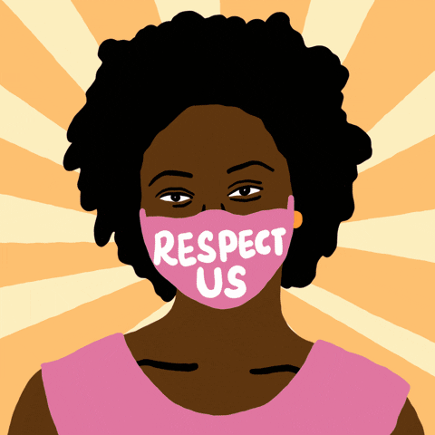
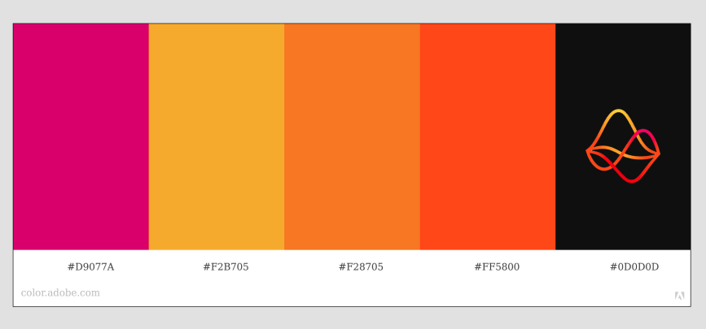
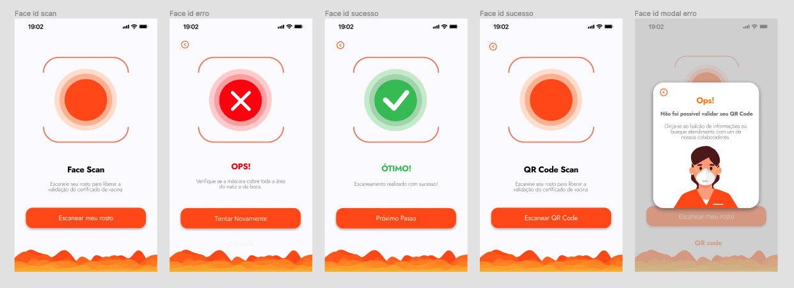

# Face Scan - Squad AVANADE

### Talent Fest SAP006 < Laboratória >

Face Scan é uma aplicação web desenvolvida para realizar reconhecimento facial, identificar se uma pessoa está utilizando uma máscara corretamente e verificar se o QR Code do Certificado Nacional de Vacinação Covid-19 está validado.  

Desenvolvido para o Talent Fest pelo Squad Avanade. 

  
   

## Índice

- [1. Desafio](#1-desafio)
- [2. Histórias de usuário](#2-histórias-de-usuário)
- [3. Protótipo](#3-protótipo)
- [4. A aplicação](#4-a-aplicação)
- [5. Tecnologias utilizadas](#5-tecnologias-utilizadas)
- [Desenvolvedoras](#desenvolvedoras)

---

## 1. Desafio

Com a COVID-19 fica cada vez mais difícil para os estabelecimentos terem controle sobre as pessoas que entram utilizando máscara e principalmente se estão com o programa vacinal completo. Pensando nisso precisamos desenvolver um aplicativo onde seja possível identificar se as pessoas estão utilizando a máscara e caso estejam utilizando precisamos identificar se elas estão com seus comprovantes de vacinação, dadas as limitações para validar o comprovante vacinal de forma automatizada, o comprovante será armazenado em uma base de dados (firebase) e o usuário será liberado em regime de contingência. Uma vez que a liberação foi feita o usuário passa a ter acesso
NORMAL.

### Product Backlog

- Interface com integraçao com câmera para exibir ao usuário o que fazer;
- Reconhecimento facial com identificação de máscara no rosto (restringir acesso de pessoas com máscara no queixo ou nariz de fora);
- App com câmera;
- Leitura de QR Code do comprovante de vaciação;
- Consultar QR Code na nossa base de dados, se o QR Code estiver válido ele ele deixa passar com status liberado;
- Se não estiver presente devemos deixar passar, mas com status de pendente validação manual, caso o QR Code não seja aprovado devemos barrar o acesso do usuário;

### Cognetive Services | Face API 
Uso do serviço cognitivo do Azure para reconhecer um rosto e o elemento máscara devidamente posicionado.
Site/App. Para a criação de uma autorização é necessário o desenvolvimento de um site ou app com câmera para
validar se a pessoa está usando a máscara corretamente, e posteriormente se a vacinação está em dia
através do QRCode.

## 2. Histórias de usuário

#### [Historia de usuario 1] Verificação de uso correto da máscara de proteção

- Eu, como usuário da aplicação, gostaria de verificar se minha máscara cobre nariz e boca adequadamente usando o reconhecimento facial.

##### Critérios de aceitação

- Acessar uma tela de inicial;
- Reconhecer uso adequado da mascara, cobrindo totalmente boca e nariz;
- Apresentar mensagem de erro caso o uso esteja inadequado;
- Apresentar mensagem de sucesso, caso a mascara esteja cobrindo totalmenteo boca e nariz;

#### [Historia de usuario 2] Verificação de QR Code do Certificado Nacional de Vacinação Covid-19

- Eu, como usuário da aplicação, gostaria de verificar se o QR Code está válido para acessar estabelecimento.

##### Critérios de aceitação

- Acessar uma tela para escaneamento de QR COde;
- Acessar banco de dados e verificar se registro do certificado está validado;
- Apresentar mensagem de erro, caso não encontre o certificado;
- Apresentar mensagem de sucesso, caso a certificado seja encontrado;

---

## 3. Protótipo

### Paleta de cores escolhida

### Protótipo desenvolvido usando Figma

## 4. A aplicação

Desenvolvido para tablet (1024 X 1366)

### Reconhecimento facial do uso correto da máscara

### Leitura do QR Code do certificado de vacinação

 

###  QR codes para testar

<table align="center">
  <tr>
      <td align="center">
             
            
            <b>Vacinação Covid-19 em dia</b> 
            
      </td>
    <td align="center">
         
        
          <b>Registro de vacinação não encontrado </b> 
        
    </td>
  </tr>
</table>

 

## 5. Tecnologias utilizadas

  <a href="https://github.com/caroAlvim">

  

 
  
  
  
  
  
  
  
  
  
  

 
  
## Desenvolvedoras
  
A aplicação foi desenvolvida em três dias durante o 6º Talent Fest 2021 promovido pelo bootcamp < Laboratória >. 

Gostariamos de agradecer todo o apoio da equipe da Avanade, especialmente a Luciana Ramos, Victor Fructuoso, Camila Ferreira Ribeiro e Henrique Eduardo. 

<table align="center">
  

      <h3> Squad Avanade </h3>
  

  <tr>
      <td align="center">
            <a href="https://github.com/caxconte">
             
            
            <b>Camila Conte</b> 
            
            </a>
      </td>
    <td align="center">
      <a href="https://github.com/caroAlvim">
         
        
          <b>Carolina Alvim</b> 
        
      </a>
    </td>
    <td align="center">
            <a href="https://github.com/jjullimayanne">
             
            
            <b>Julli Mayanne</b> 
            
            </a>
      </td>
   
  </tr>
</table>

<table align="center">
      <tr>
      <td>
      <a href="https://github.com/larissavilelasobral">
             
            
            <b>Larissa Vilela</b> 
            
            </a>    
      </td>
      <td>
            <a href="https://github.com/mayarabezerra">
             
            
            <b>Mayara Bezerra</b> 
            
            </a>
      </td>
      <td>
            <a href="https://github.com/crisbdev">
             
            
            <b>Patricia Carvalho</b> 
            
            </a>
      </td>
      </tr>

</table>

## 
  

 

